<!DOCTYPE html>
<html lang="en">
<head>
	<meta charset="UTF-8">
	<meta name="viewport" content="width=device-width, initial-scale=1.0">
	<title>Water Wastage </title>
	<link rel="stylesheet" href="wwm.css">
</head>
<body>
	<header>
		<nav>
            
			    <ul>
				    <li><a href="#home">Home</a></li>
				    <li><a href="#gallery">Gallery</a></li>
				    <li><a href="#challenges">Challenges</a></li>
				    <li><a href="#solution">Solution</a></li>
				    <li><a href="#contact">Contact</a></li>
            <li><a href="#donate">donate</a></li>
			    </ul>
    
		</nav>
        
		

			<h1>Water Wastage</h1>*
            <h2>Don't let your future go down the drain - save water today</h2>
            <h3>Join the water conservation movement and make a difference</h3>
			<a href="#gallery">Learn More</a>
		

	</header>
	
        
		<section id="gallery">
			<h2>Gallery</h2>
			

				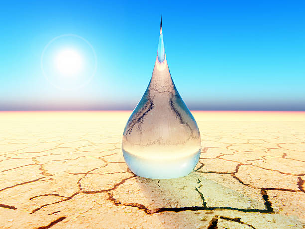
				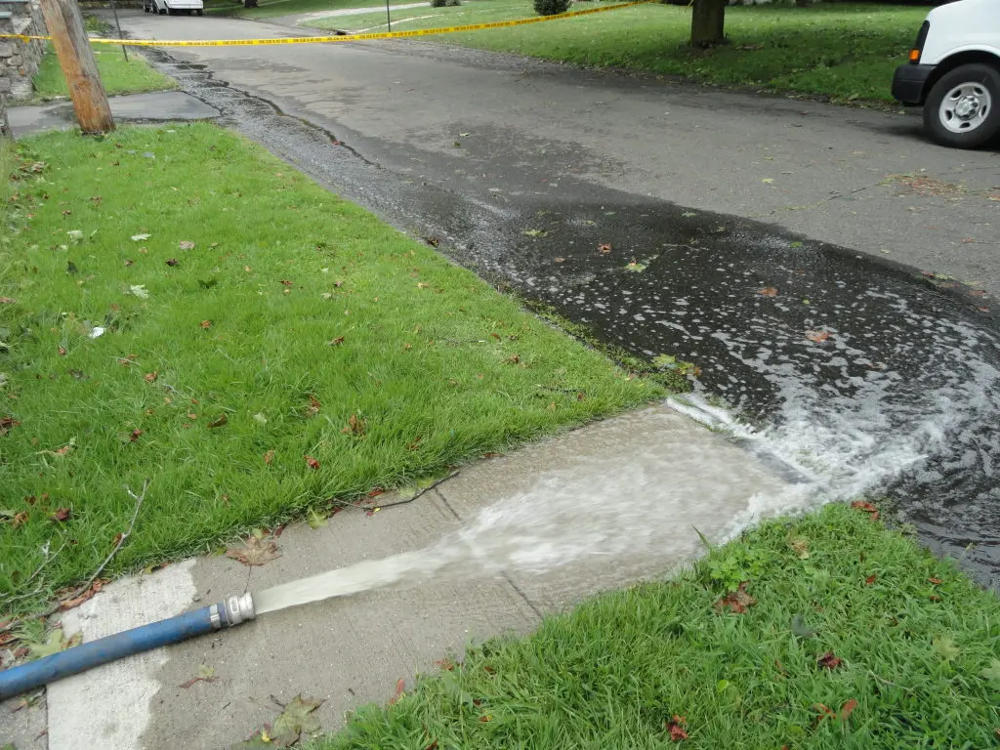
				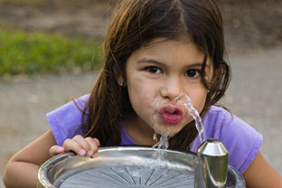
				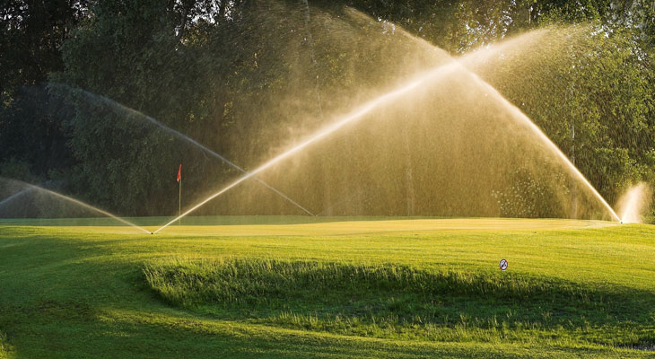
        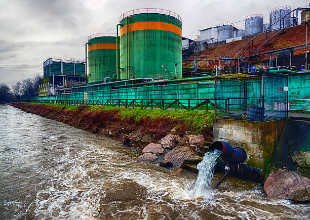 
        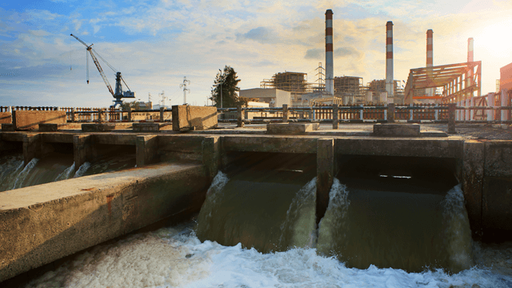
        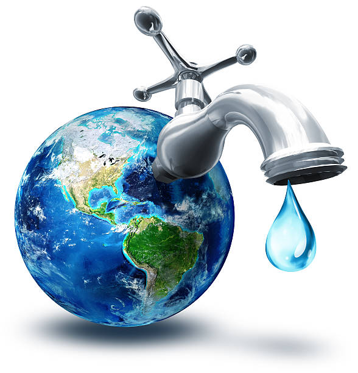
        
            

                
		</section>
		<section id="challenges">
            

			<h1>Challenges</h1>
      <h2>1. Lack of Awareness</h2>
      

        
      

            
One of the biggest challenges to water wastage is a lack of awareness 
                among individuals and communities about the importance of water conservation. 
                Without understanding the consequences of water wastage, people may continue to 
                engage in water-intensive activities that contribute to the depletion
                 of freshwater resources.

                 <h2>2. Poor Water Management Practices</h2>
                 

                  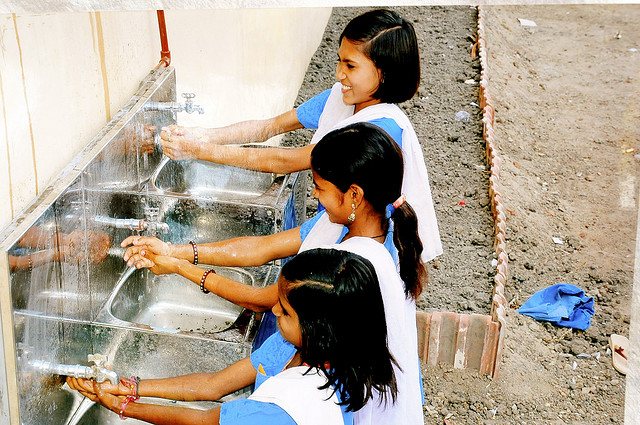
                

            
            
Inefficient water management practices, such as over-extraction, 
                contamination, and inadequate distribution systems, can also contribute to 
                water wastage. Without proper monitoring and management, water resources can be depleted 
                faster than they can be replenished, leading to water scarcity and other environmental problems.

                <h2>3. Climate Change</h2>
                

                  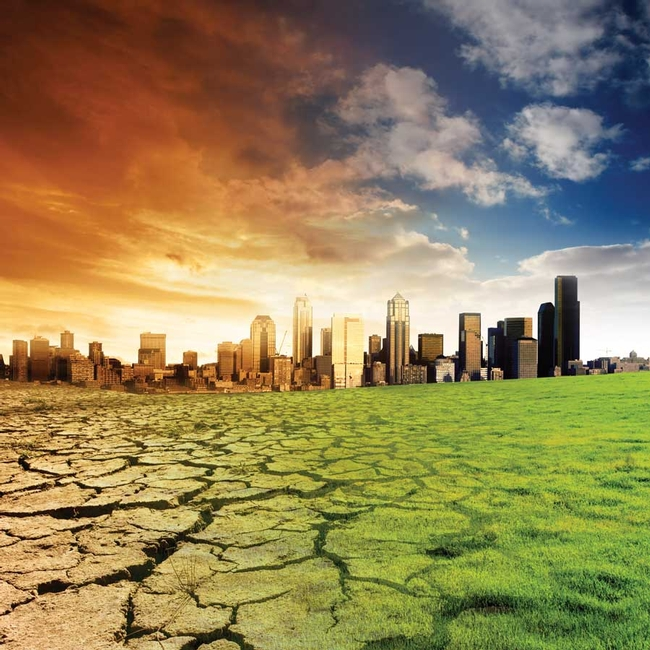
                

            
            
Climate change is another significant challenge to water wastage.
                 As temperatures rise and weather patterns become more unpredictable, water availability
                  can be affected, leading to droughts, floods, and other extreme weather events that can
                   cause water wastage and other related problems.

                   <h2>4. Rapid Urbanization</h2>
                   

                    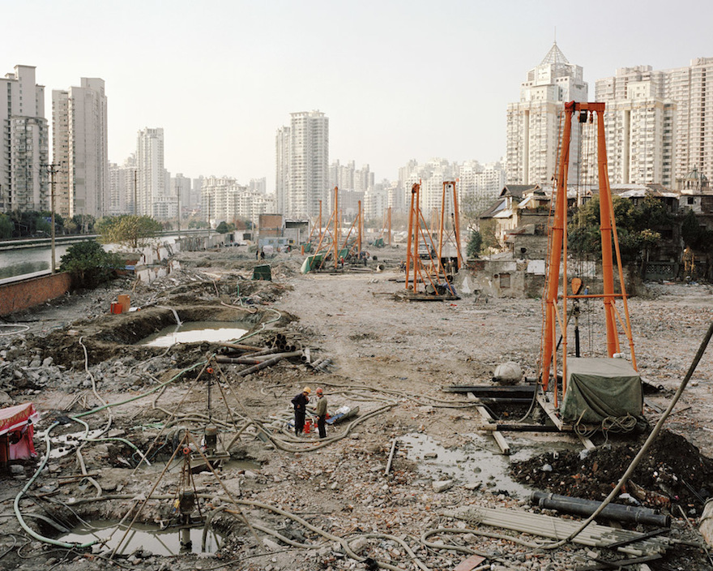
                   

           
            
The rapid growth of cities and urban areas is also a significant challenge 
                to water wastage. Urbanization leads to increased demand for water, which can put pressure on 
                freshwater resources. In addition, inadequate infrastructure, such as sewage and waste treatment 
                plants, can contribute to water contamination and wastage.

                <h2>5. Overconsumption</h2>
                

                  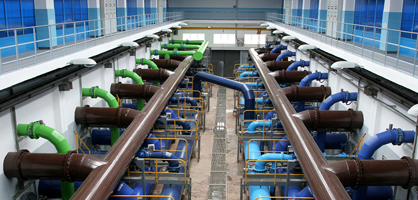
                 

            
            
Overconsumption of water is another challenge to water wastage. Many activities, 
                such as industrial processes and agriculture, require large amounts of water, 
                which can lead to overconsumption and depletion of freshwater resources. In addition,
                 inefficient water use practices, such as using excessive amounts of water for irrigation or
                  washing, can contribute to water wastage.
	
                 
 
            </section>

 <section id="solution">
	

    
  
    <h1>Solution</h1>
    
    <h2 id="solution-header">1. Promote Water Conservation Behaviors</h2>
    

      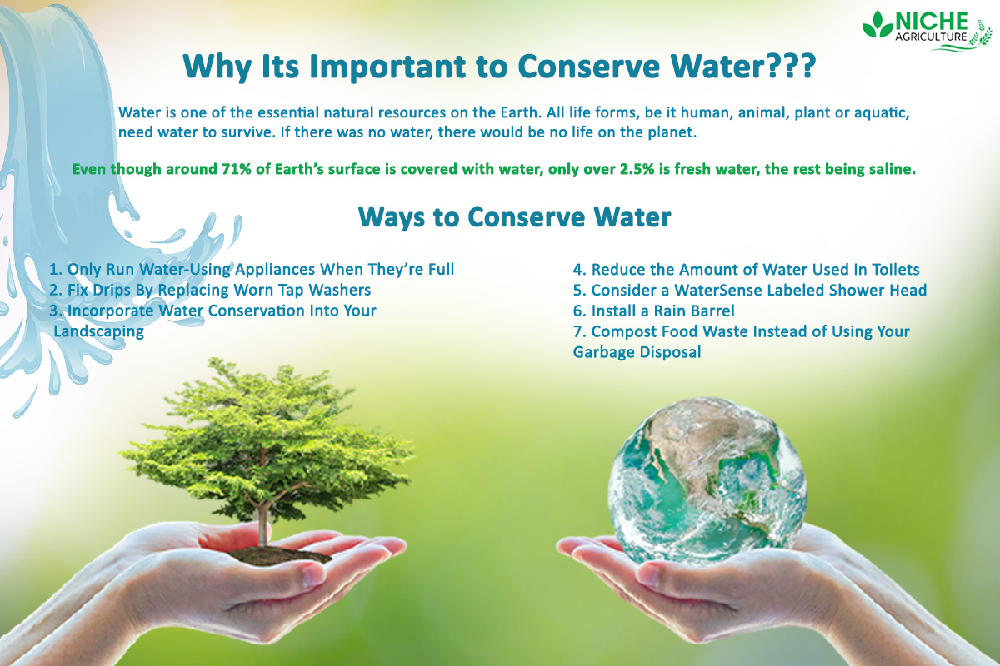
     

    
One of the most effective ways to tackle water wastage is
         to promote water conservation behaviors among individuals and communities. This can be 
         achieved through educational campaigns, incentives for water conservation, and regulations
          that encourage responsible water use. By raising awareness of the importance of water conservation, 
          we can reduce water wastage and ensure the sustainability of freshwater resources.

    
    <h2 id="solution-header">2. Invest in Water-Efficient Technologies</h2>
    

      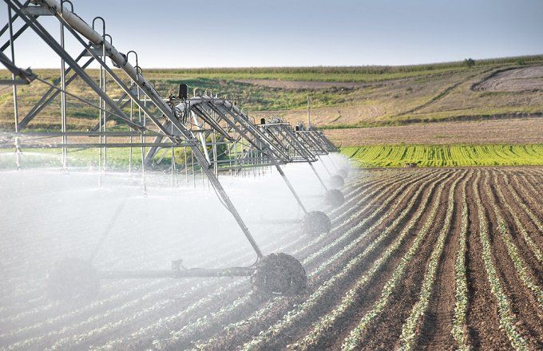
     

    
Another solution to water wastage is to invest in water-efficient technologies. 
        This includes technologies such as drip irrigation, low-flow showerheads, and water-efficient washing machines, 
        which can significantly reduce water consumption without compromising on performance. By adopting water-efficient
         technologies, we can reduce water wastage and ensure that we are using freshwater resources in a responsible and 
         sustainable way.

    
    <h2 id="solution-header">3. Improve Water Management Practices</h2>
    

      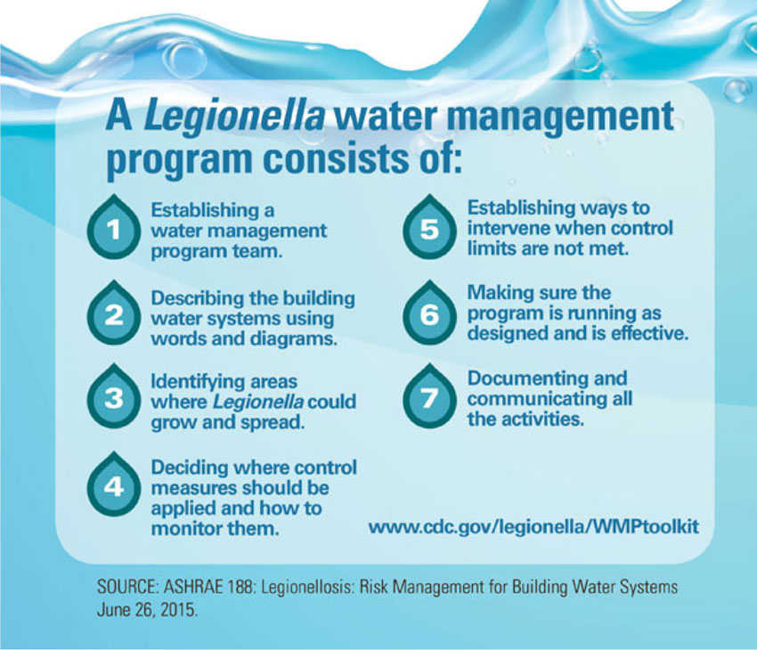
     

    
Effective water management practices are also 
        critical to reducing water wastage. This includes monitoring and regulating water use, 
        implementing water recycling and reuse systems, and investing in infrastructure that supports sustainable water management. 
        By improving water management practices, we can reduce water wastage and ensure that we are using freshwater resources 
        in a responsible and sustainable way.

    
    <h2 id="solution-header">4. Use Technology to Monitor Water Use</h2>
    

      
     

    
Technology can play a vital role in monitoring water use and
         identifying areas where water wastage is occurring. This includes using smart meters, sensors, and
          other technologies to track water use and identify opportunities for improvement. By using technology to monitor water use, 
          we can identify and address water wastage in real-time, reducing water consumption and ensuring the sustainability of 
          freshwater resources.

    
    <h2 id="solution-header">5. Implement Policy Interventions</h2>
    

      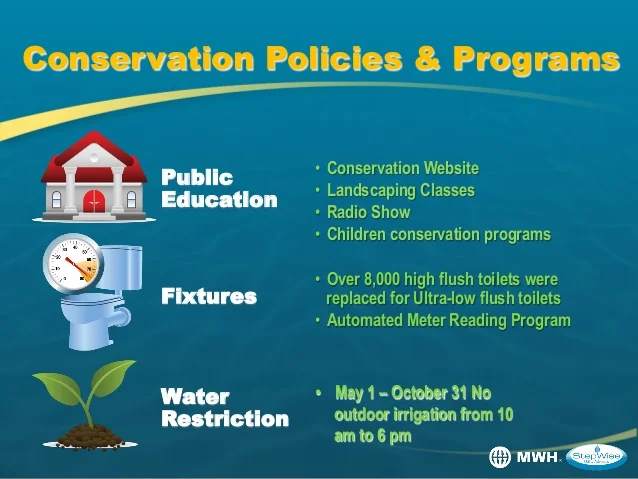
     

    
Policy interventions, such as regulations and incentives, 
        can also play a critical role in reducing water wastage. This includes regulations that require businesses
         and individuals to use water-efficient technologies, incentives for water conservation, and penalties for water wastage. 
         By implementing policy interventions, we can encourage responsible water use and reduce water wastage, ensuring the sustainability
         of freshwater resources for future generations.

    

    </section>
           <section id="contact">
                   

                    <h2>Contact Us</h2>
                    
If you have any questions or comments, please feel free to contact us using the form below.

                    <form action="submit-form.php" method="post">
                      <label for="name">Name:</label>
                      <input type="text" id="name" name="name" required>
                      <label for="email">Email:</label>
                      <input type="email" id="email" name="email" required>
                      <label for="message">Message:</label>
                      <textarea id="message" name="message" required></textarea>
                      <button type="submit" class="submit-button">Submit</button>
                    </form>
                   

            </section>       
                  <section id="donate">
                   

                    <h2>Support Our Cause</h2>
                    
Your donation can help us make a difference in the world. Every dollar counts!

                    <button type="button" class="donate-button">
                      Donate Now
                    </button>
                    
Alternatively, you can send us a check or money order to:

                    <address>
                      Lovely Professional University 
                      Jalandhar,India
                    </address>
                   

                   </section>
                   

                    

                      <h3>Email Us</h3>
                      <ul>
                        <li>example1@gmail.com</li>
                        <li>example2@gmail.com</li>
                        <li>example3@gmail.com</li>
                      </ul>
                    

                    

                      <h3>Contact Information</h3>
                      <ul>
                        <li>+1 (123) 456-7890</li>
                        <li>+1 (123) 456-7891</li>
                        <li>+1 (123) 456-7892</li>
                      </ul>
                    

                    

                      <h3>Website Owner</h3>
                      
Harsh Kumar (16)

                      
M S Mohamed Shahasin (17)

                      
Abhishek Kumar (18)

                      
                    

                    

                        <h3>Quick Links</h3>
                        <li><a href="#gallery">Gallery</a></li>
                        <li><a href="#challenges">Challenges</a></li>
                        <li><a href="#solution">Solution</a></li>
                        <li><a href="#contact">Contact</a></li>
                        <li><a href="#donate">donate</a></li>
                      

                  

                  
                   
                         
